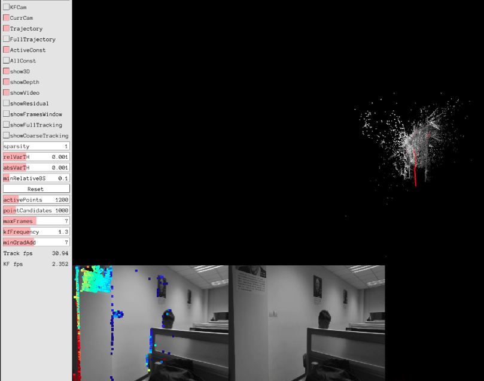

# dso_ros笔记本摄像头的安装与跑通

### 环境

- Ubuntu16.04
- ROS-kinetic
- dso_ros catkin版本
- 笔记本自带单目摄像头
- 安装编译成功的DSO

### 安装编译dso_ros

```
cd ~/catkin_dso/src
git clone https://github.com/JakobEngel/dso_ros.git #这里是catkin版本
export DSO_PATH=/home/YOUR_DSO_PATH/dso
cd dso_ros
gedit CMakeLists.txt
# 修改bin文件路径 
set(EXECUTABLE_OUTPUT_PATH ${PROJECT_SOURCE_DIR}/bin) 
# 如果不修改，编译生成的bin将会存在build目录下，rosrun会找不到
mkdir build
cd build
cmake ..
make
sudo make install
cd ~/catkin_dso
catkin_make

```
### 安装编译usb_cam

```
cd ~/catkin_dso/src
git clone https://github.com/bosch-ros-pkg/usb_cam.git 
cd ..
catkin_make
source ~/catkin_dso/devel/setup.bash
```
### 笔记本相机ROS标定

- ROSwiki有相机矫正的官方文档，有单目的也有立体相机的教程，[官方链接](http://wiki.ros.org/camera_calibration)

- [参考链接](https://blog.csdn.net/qq_30460905/article/details/80390576)

##### 1 下载标定板

 [标定板下载链接](http://wiki.ros.org/camera_calibration/Tutorials/MonocularCalibration?action=AttachFile&do=view&target=check-108.pdf)
 
 标定板为8x6,A4纸打印出来为，用直尺量square边长为24.5mm（这个根据自己标定板的大小自己量，大点好），即0.0245m，作为标定输入参数。
 
##### 2 打开相机

```
cd ~/catkin_dso
source devel/setup.bash
roslaunch usb_cam usb_cam-test.get
# launch文件里面默认设备为/dev/video0,外接USB摄像头是有可能是/dev/video1，根据具体情况而定)
# 如果你没有矫正过的话，你会发现打开相机时会有一条警告
```

##### 3 开始矫正

一般来说正常安装ros都是包含了camera_calibration，输入下面命令检查一下

```
~$ rosdep install camera_calibration
#All required rosdeps installed successfull

```

执行矫正文件

 `rosrun camera_calibration cameracalibrator.py --size 8x6 --square 0.0245 image:=/usb_cam/image_raw camera:=/usb_cam`
 
弹出display窗口
 
**注意：**如果没有的话检查你命令输入是否输入正确，例如：8x6,中间不能用 "*" ,是字母 "x"，--size，--square前面是两个"-"，还要注意你的相机发出的话题是不是`usb_cam/image_raw`

##### 4 采集样本

- 使得标定板尽量出现在摄像头视野的各个位置里
- CALIBRATE按钮变绿色，点击等待
- 点击COMMIT将结果保存到电脑路径：/home/××××/.ros/camera_info/head_camera.yaml

##### 5 结果格式例下

```
[image]
width
640
height
480
[narrow_stereo]
camera matrix
644.987121 0.000000 331.735116
0.000000 647.308571 248.505845
0.000000 0.000000 1.000000

distortion
0.248372 -0.436036 -0.008074 -0.000495 0.000000

rectification
1.000000 0.000000 0.000000
0.000000 1.000000 0.000000
0.000000 0.000000 1.000000

projection
669.478394 0.000000 331.064954 0.000000
0.000000 669.226440 245.232233 0.000000
0.000000 0.000000 1.000000 0.000000

```

参数意义：

image_width、image_height代表图片的长宽 camera_name为摄像头名 
camera_matrix规定了摄像头的内部参数矩阵 
distortion_model指定了畸变模型 
distortion_coefficients指定畸变模型的系数 
rectification_matrix为矫正矩阵，一般为单位阵 
projection_matrix为外部世界坐标到像平面的投影矩阵

### 运行dso_ros

编写相机文件：

`gedit ~/catkin_dso/src/dso_ros/camera.txt`

格式如下：

```
 fx fy cx cy k1 k2 r1 r2
in_width in_height
"crop" / "full" / "fx fy cx cy 0"
out_width out_height

```
不同相机的格式写法不同，[官方链接](https://github.com/JakobEngel/dso)

打开一个终端

`roscore`

再开终端

```
source ~/catkin_dso/devel/setup.bash
roslaunch usb_cam usb_cam-test.launch
```

再开终端

```
source ~/catkin_dso/devel/setup.bash
rosrun dso_ros dso_live image:=/usb_cam/image_raw calib=/home/YOUR_PATH/camera.txt mode=1
```

### 跑通图示

笔记本摄像头跑通截图：



### 可能遇到的问题

`error1`

```
/usr/bin/ld: CMakeFiles/dso_live.dir/src/main.cpp.o: undefined reference to symbol '_ZN5boost6system15system_categoryEv'
/usr/lib/x86_64-linux-gnu/libboost_system.so: error adding symbols: DSO missing from command line
collect2: error: ld returned 1 exit status
CMakeFiles/dso_live.dir/build.make:198: recipe for target 'bin/dso_live' failed
make[3]: *** [bin/dso_live] Error 1
```

##### error1解决办法

```
cd ~/catkin_dso/src/dso_ros
gedit CMakeLists.txt
# 编辑前：
target_link_libraries(dso_live ${DSO_LIBRARY} ${Pangolin_LIBRARIES} ${OpenCV_LIBS})
 
# 编辑后：
target_link_libraries(dso_live ${DSO_LIBRARY} ${Pangolin_LIBRARIES} ${OpenCV_LIBS} GL glut GLU boost_system)
```
`error2`

```
# 运行dso_ros出现

Couldn't find executable named dso_live below /home/chuanxu/catkin_dos/src/dso_ros
```
 
##### error2解决办法

- 可能原因1：下错了版本,下成了rosbuild,重新下载catkin版本并编译测试。
- 可能原因2：rosrun ××× 路径错误，找不到camera.txt，检查路径并修正即可。


`error3`

xbot上安装 usb_cam 出现error:

```
[usb_cam-1] process has died [pid 5257, exit code 1, cmd /home/zkzdzn/catkin_dso/devel/lib/usb_cam/usb_cam_node __name:=usb_cam __log:=/home/zkzdzn/.ros/log/ea6db8de-6759-11e9-a323-34415de66a2c/usb_cam-1.log].
log file: /home/zkzdzn/.ros/log/ea6db8de-6759-11e9-a323-34415de66a2c/usb_cam-1*.log
```

##### error3解决办法

- `rostopic list`
- 找到自己相机发布的image topic 例如： /camera/color/image_raw
- 找到usb_cam launch文件 修改重映射 remap 到自己相机发布的topic

```
</node>
  <node name="image_view" pkg="image_view" type="image_view" respawn="false" output="screen">
    # 修改前
    <remap from="image" to="/usb_cam/image_raw"/>
    # 修改后
    <remap from="image" to="/camera/color/image_raw"/>
    <param name="autosize" value="true" />
  </node>
</launch>
```


 