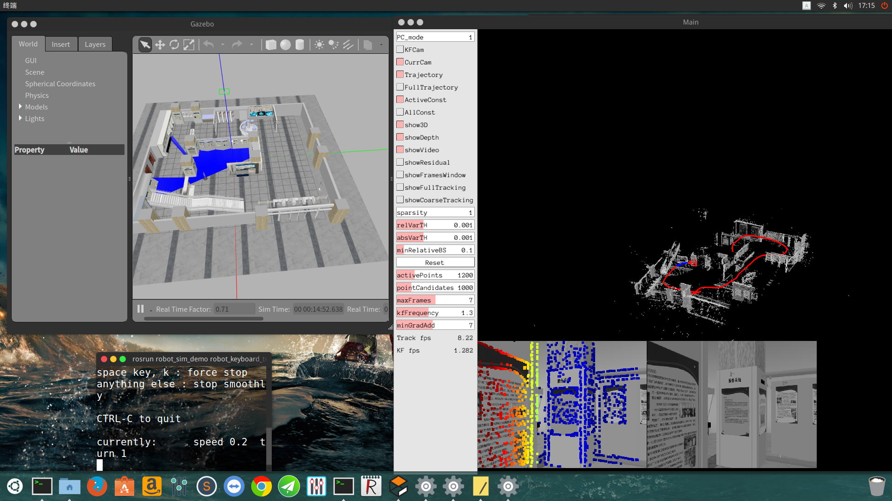
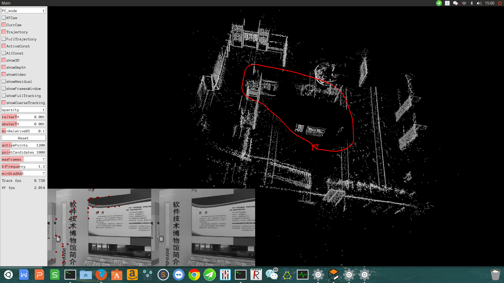

#  DSO在仿真xbot上的部署

### 环境

- Ubuntu 16.04
- bro2018fall-codes
- DSO 
- DSO_ROS catkin版本
- 仿真xbot自带摄像头

### 操作步骤

打开仿真环境:

```
cd catkin_ws/ # 包含仿真环境的工作空间
source devel/setup.bash
roslaunch robot_sim_demo robot_spawn.launch
```
重新打开一个终端,查看当前工作相机发布话题

```
rostopic list

# /camera_D415/rgb/image_raw 使我们要的发布图像信息话题

```

再打开一个终端

```
cd catkin_dso/src/usb_cam/launch
gedit usb_cam-test.launch

# 修改launch文件如下:
<launch>
  <node name="usb_cam" pkg="usb_cam" type="usb_cam_node" output="screen" >
    <param name="video_device" value="/dev/video0" />
    # 图片长和宽修改为xbot相机参数值
    <param name="image_width" value="320" />
    <param name="image_height" value="240" />
    <param name="pixel_format" value="yuyv" />
    <param name="camera_frame_id" value="usb_cam" />
    <param name="io_method" value="mmap"/>
  </node>
  <node name="image_view" pkg="image_view" type="image_view" respawn="false" output="screen">
  # 重映射xbot现在发布的话题
    <remap from="image" to="/camera_D415/rgb/image_raw"/>
    <param name="autosize" value="true" />
  </node>
</launch>
```
保存后

```
cd ~/catkin_dso
source devel/setup.bash
roslaunch usb_cam  usb_cam-test.launch
```
修改xbot仿真摄像头的camera.txt如下:

```
277.191356 277.191356 160.5 120.5 0 0 0 0
320 240
crop
320 240
```
再开一个终端

```
cd catkin_dso
source devel/setup.bash
rosrun dso_ros dso_live image:=/camera_D415/rgb/image_raw calib=/home/YOUR_PATH/camera.txt
```

再开一个终端

```
cd catkin_ws/ #仿真环境所在工作空间
source devel/setup.bash
rosrun robot_sim_demo robot_keyboard_teleop.py #启动键盘控制程序
```

### 运行结果






### 仿真中效果和问题总结

- 仿真中由于光照等因素稳定不变,所以相机的畸变矩阵参数全为0.建图效果相当好.
- 仿真中xbot上的摄像头输入分辨率太低,只有320 x 240,导致输出图像分辨率也只能是320 x 240,更低的话算法会报错,因为图分辨率过低无法进行建图,没有进行降低分辨率的输出,结果就是:建图缓慢,转弯丢失,和在现实中部署效果一致

### 改进建议

- 将xbot携带的摄像头数据进行修改提升,预计效果显著提升.
