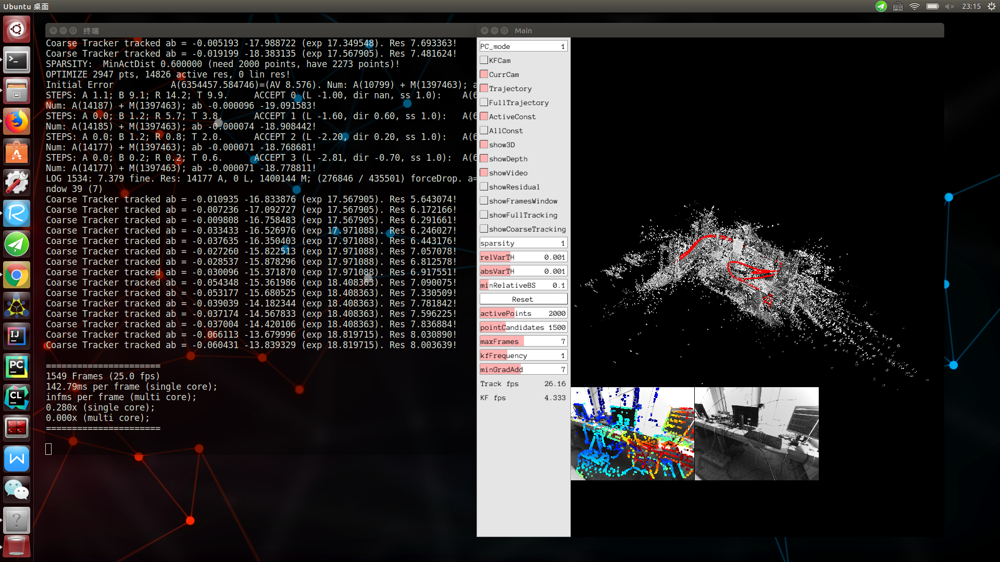

# DSO安装与测试

### 运行环境

- Ubuntu 16.04
- ROS-kinetic
- Mono-steoro单目摄像头

### 依赖

DSO依赖项很少，只有Eigen3，pangolin，opencv等少数几个大家都已经很熟悉的库，作者的github页面上对安装DSO做了很详细说明，[DSO下载以及安装链接https://github.com/JakobEngel/dso](https://github.com/JakobEngel/dso)因此，安装DSO比较容易： 

##### 1. 安装eigen3

`sudo apt-get install libsuitesparse-dev libeigen3-dev libboost-all-dev`

##### 2. 安装openCV. 

DSO对opencv依赖很少，仅仅读或者写图像等一些简单操作。

`sudo apt-get install libopencv-dev`

##### 3. 安装pangolin. 

按照Pangolin的github主页[安装教程](https://github.com/stevenlovegrove/Pangolin)


##### 4. 安装ziplib. 

```
sudo apt-get install zlib1g-dev 
cd thirdparty #找到dso所在文件路径，切换到thirdparty文件夹下 
tar -zxvf libzip-1.1.1.tar.gz 
cd libzip-1.1.1/ 
./configure 
make 
sudo make install 
sudo cp lib/zipconf.h /usr/local/include/zipconf.h

```

##### 5. 安装编译DSO

首先可以单独穿件一个dso的工作空间：

```
mkdir -p ~/catkin_dso/src
cd catkin_dso/src
catkin_init_workspace

```

下载dso源码并编译：

```
git clone https://github.com/JakobEngel/dso.git
cd dso 
mkdir build 
cd build 
cmake .. 
make 

```

### 测试DSO

##### 1.查看dso_dataset 

```
cd /dso/build/bin
ls
```
如果存在`dso_dataset`,则说明DSO编译成功。

##### 2.TUM单目数据集上运行DSO

请下载TUM数据集：

```
# 42GB TUM数据集　用于VO和SLAM
scp stu8@47.111.6.8:/data/all_sequences.zip ./
# TUM数据集也可以下载部分序列进行使用
[官方链接](https://vision.in.tum.de/data/datasets/mono-dataset?redirect=1)
# 推荐单序列下载
```

把下载的包解压到bin目录下,然后切换到DSO的bin目录下，使用下列命令执行程序。

```
cd /home/YOUR_PATH/dso/build/bin 
./dso_dataset files=./sequence_12/images.zip calib=./sequence_12/camera.txt gamma=./sequence_12/pcalib.txt vignette=./sequence_12/vignette.png preset=0 mode=0
```
其中files为数据集图片压缩包，calib为相机内参数文件，gamma和vignette为相机的一些特性参数，光度标定文件。mode为DSO模式切换，如０为包含光度表达文件，１为只包含内参数，２为没有畸变参数. preset为设定DSO运行时的参数，如选取的像素点个数等等。preset＝3是preset＝０的５倍速运行DSO。 
数据集运行结果如下： 



### 遇到的问题与解决

`error 1:`

运行`./dso_dataset fileXXXXX`时候出现

```
=============== PRESET Settings: ===============
DEFAULT settings:
- no  real-time enforcing
- 2000 active points
- 5-7 active frames
- 1-6 LM iteration each KF
- original image resolution
==============================================
PHOTOMETRIC MODE WITHOUT CALIBRATION!
ERROR 9 reading archive /home/YOUR_PATH/dso/built/bin/sequence_12/images.zip!
```

#### error1解决办法

因为 `sudo apt-get install zlib1g-dev `安装的解压版本没更新,可能已经更新了还不行,则手动解压TUM数据序列集合中的`images.zip`,然后在`./dso_dataset fileXXXXX`中也修改为:

```
./dso_dataset files=./sequence_12/images calib=./sequence_12/camera.txt gamma=./sequence_12/pcalib.txt vignette=./sequence_12/vignette.png preset=0 mode=0
```
即可.

`error 2:`

运行`./dso_dataset fileXXXXX`时候出现

```
Reading Calibration from file  ... not found. Cannot operate without calibration, shutting down.
段错误 (核心已转储)
```

#### error2解决办法

因为 指令中的路径写错,检查路径后修正即可跑通.