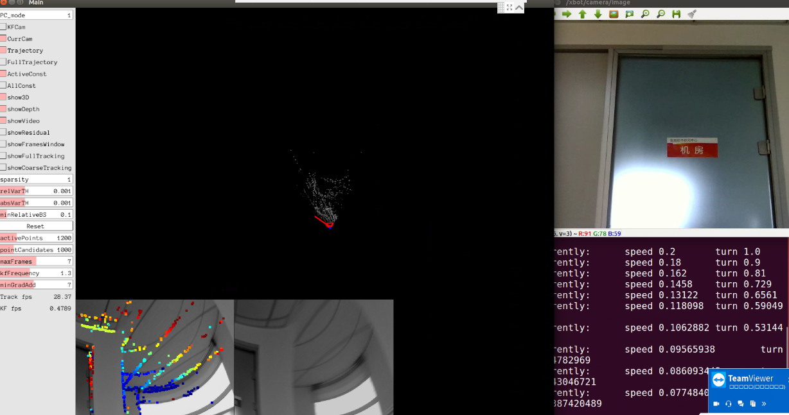
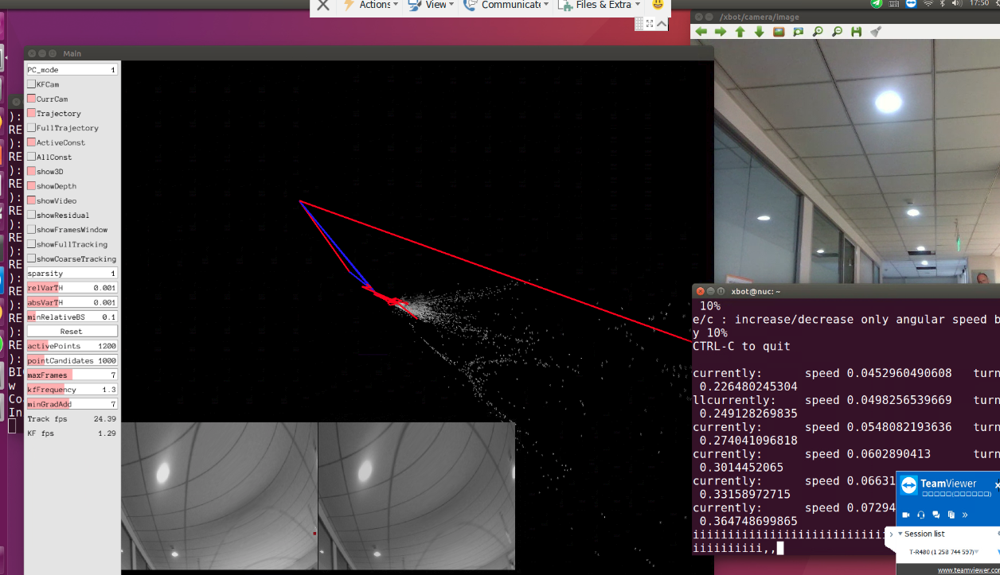
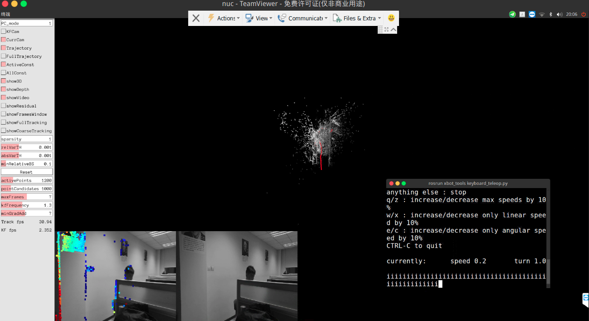
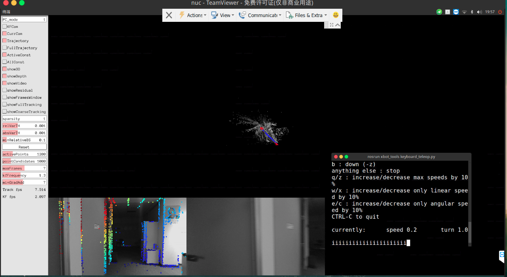
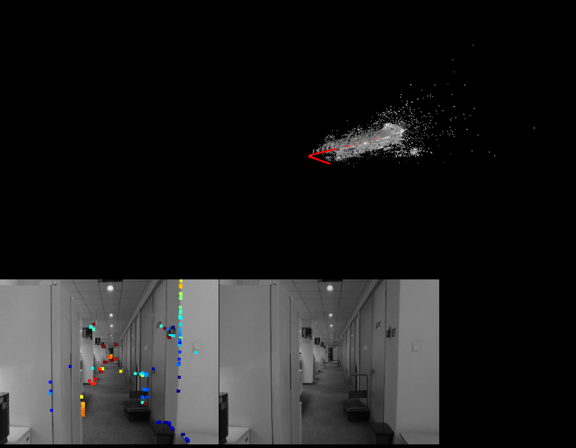

# DSO部署到xbot

### 环境

- xbot
- Ubuntu16.04
- realsense D415

### 概述

在xbot上部署DSO，因为DSO开源代码仅仅支持单目，所以只能把D415当成单目相机来使用，利用它的`camera/color/image_raw`话题传图像给DSO。所以安装配置和在笔记本上跑单目摄像头类似，不同点和注意事项，会在下文中详述。

### 安装DSO

[DSO安装与测试](./DSO安装与测试文档.md)

### 安装DSO_ROS

[dso_ros笔记本摄像头的安装与跑通](./DSO_ROS笔记本摄像头的安装与跑通.md)

##### 不同点

- xbot自带有两个摄像头，1个是人脸识别用摄像头，发布`/xbot/camera/image`话题，因为存在仰角，建图效果不好。
- 2个是D415深度摄像头，我们利用其发布的图像信息（深度信息不用）：`/camera/color/image_raw`话题，需要修改对应的usb_cam launch文件。

##### 注意 一

>由于DSO的算法特性，DSO是少数使用纯直接法（Fully direct）计算视觉里程计的系统之一，特征点法通过最小化重投影误差来计算相机位姿与地图点的位置，而直接法则最小化光度误差（photometric error）。所谓光度误差是说，最小化的目标函数，通常由图像之间的误差来决定，而非重投影之后的几何误差。

所以对于光照等环境因素特别敏感，需要相机标定 D415标定文件如下：

```
[image]

width
1280

height
720

[narrow_stereo]

camera matrix
949.986527 0.000000 633.906959
0.000000 947.609436 367.183306
0.000000 0.000000 1.000000

distortion
0.178151 -0.290003 0.011788 -0.007432 0.000000

rectification
1.000000 0.000000 0.000000
0.000000 1.000000 0.000000
0.000000 0.000000 1.000000

projection
972.381348 0.000000 623.361679 0.000000
0.000000 979.284973 374.045475 0.000000
0.000000 0.000000 1.000000 0.000000
```

##### 注意 二

camera.txt写法，其中cx cy fx fy是相机的内参矩阵，后面四个是畸变矩阵参数 d1 d2 d3 d4 

如果写错参数，会出现各种图片扭曲结果或者算法跑不通

如下图：




##### 注意 三

>在SLAM领域，DSO属于稀疏直接法，据论文称能达到传统特征点法的五倍速度（需要降低图像分辨率），并保持同等或更高精度

所以在camera.txt文件中。输出图像分辨率要进行合适的降低，D415的输入分辨率可达1280 x 720 输出改写为 640 x 480

如果不进行降低分辨率操作，则会出现转弯失帧，加速失帧，程序崩溃，图像点过少，建图效果很差。

如下图：



##### 相关issue

对于该算法，详细的测试踩坑issue[链接](https://yt.droid.ac.cn/beijing/nagato-yuki/issues/76)

### 部署成功效果图





增加输入分辨率效果图

输入分辨率 `1280 x 720`



走廊建图效果：



