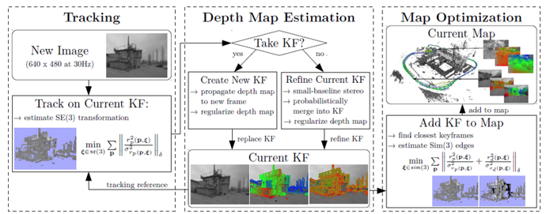
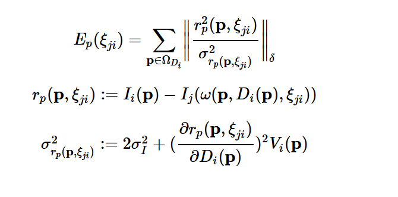
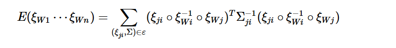

## LSD算法思路初步解析
LSD-SLAM系统整个过程分为三大模块，第一个模块是Tracking,第二个模块是Depth Map Estimation, 第三个模块是Map Optimization

1\.跟踪部分连续地跟踪摄像机获取的图像，即估计相对于当前的关键帧的刚体变换位姿，其中初始值为前一帧的位姿。   
2\.深度地图估计部分将跟踪的帧用于精化或者替代当前关键帧。通过对像素小基线立体的比较滤波和空间规则化来精化深度。如果相机移动过快，通过将已存在的邻近的关键帧的点投影到当前帧来初始化一个新的关键帧。   
3\.地图优化部分将作为当前跟踪参考帧的关键帧整合到全局地图中，该关键帧的深度地图将不再进行精化。此外，使用尺度感知的直接图像配准方法估计相对于临近关键帧的相似变换，实现回路闭合和尺度漂移的检测。
### Tracking
tracking部分使用直接法即最小化光度误差，每当获取一张新的帧时，就对它进行Tracking。论文进行了一些小的改进，使用的是方差归一化后的光度误差（variance-normalized photometric error）：

### Depth Map Estimation
这部分主要是用Tracking跟踪后的帧更新或构建深度图，分两种情况：
     1.构建关键帧时，则构建新的深度图（Depth Map Creation）
     2.不构建关键帧时，则更新当前关键帧的深度图（Depth Map Refinement）
 其中，是否构建关键帧是通过计算当前帧与当前关键帧的距离判断的，大于一定距离时才构建新的关键帧。
 当我们获得一个新的帧，并且判断不构建新的关键帧，则进行当前关键帧深度图的更新过程。这部分论文中称为基于立体匹配的深度更新（Stereo-Based Depth Map Update），具体可分为以下四个步骤：
     1.根据一些标准选择出“好的”像素
     2.为每个像素自适应选择最合适的参考帧
     3.极线上进行立体匹配
     4.深度观测融合
#### 1.选择出“好的”像素
部分论文中称为不确定性估计（Uncertainty Estimation），主要通过建模（对逆深度的不确定度进行估计），并以此为依据挑选出好的像素。
#### 2.为每个像素自适应选择参考帧
挑选好像素后，需要为每个像素找合适的参考帧。为什么需要找合适的参考帧？因为在立体视觉中：
     小基线，准确度accuracy高，精度precision低
     大基线，准确度accuracy低(有局部最小值，易误匹配)，精度precision高

因此，必须尽可能选择距离当前帧较远的帧作为参考帧，但是当极线上超过一定距离还没有匹配到，就需要退而求其次，选择距离较近的、新获得的这些帧作为参考帧。
#### 3.立体匹配策略
在立体匹配的过程中，论文采用了极线段上５个采样点计算SSD误差的方式。采用５个点主要的方式很大程度上提高了匹配的效率。由于这５个点是相邻的，在极线段上移动的时候，每次只需要更新一个点的值，这就非常高效了。
#### 4.深度观测融合
通过当前帧匹配的像素为深度提供一个新的观测值，然后就可以把当前观测的深度融合到关键帧的深度地图中去。

### Map Optimization
这部分在论文中叫建图一致性约束（constraint acquisition），是算法的核心（解决尺度问题）。因为长距离会出现尺度漂移，因此建图一致性约束也就是做闭环检测和全局优化。

单目slam由于它的绝对尺度信息是不能直接得到的(一只眼睛很难确定远近)，导致长距离运动之后，会产生巨大的尺度漂移。为了解决这个问题，需要对地图进行全局优化。
 首先需要插图关键帧到地图当中，在插入帧的同时，还需要知道两帧之间是如何变换的，由于我们是单目slam，尺度漂移几乎是不可避免的，因此如果在这么”大”的一个尺度上，还是用se(3)，可能会导致两帧之间的变换不那么准确，因此LSD放出一个尺度的自由度，使用sim(3)来衡量两帧之间的变换，也就是说，需要找到一个sim(3)群中的变换kesi，使得误差最小。
 如何去寻找要插入的位置呢？首先去寻找所有可能相似的关键帧，并计算视觉意义上的相似度，之后对这些帧进行排序，得到最相似的那几帧，某一帧的相似度足够高，那么便将这一帧插入map中，最后执行图优化（g2o中的pose graph optimization），边为连接关系，节点为关键帧，即优化：

