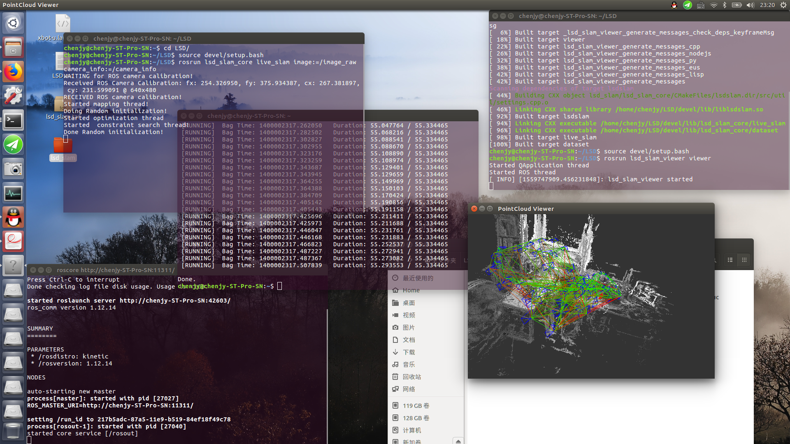

# LSD部署

### 环境

* Ubuntu 16.04
* [LSD代码包](https://yt.droid.ac.cn/xbot-u/vslam-evaluation/blob/master/LSD/lsd_slam.tar)
* [数据集](http://vmcremers8.informatik.tu-muenchen.de/lsd/LSD_room.bag.zip)

### 操作步骤

- 安装依赖
```
mkdir -p ~/catkin_lsdws/src
cd ~/catkin_lsdws/src/
sudo apt-get install ros-kinetic-libg2o ros-kinetic-cv-bridge liblapack-dev libblas-dev freeglut3-dev libsuitesparse-dev libx11-dev
sudo apt install libqglviewer-dev-qt4
cd /usr/lib/x86_64-linux-gnu
sudo ln -s libQGLViewer-qt4.so libQGLViewer.so
```
下载链接的lsd_slam.tar文件并解压到~/catkin_lsdws/src目录下

修改 `~/catkin_lsdws/src/lsd_slam/lsd_slam_core/src/util/settings.cpp` 文件代码` bool displayDepthMap = true ` 为` bool displayDepthMap = false `

- 编译LSD

```
cd  ~/catkin_lsdws
catkin_make 
```

- 启动LSD

```
cd  ~/catkin_lsdws
source devel/setup.bash
rosrun lsd_slam_viewer viewer
```
<br>再开一个终端
```
cd  ~/catkin_lsdws 
source devel/setup.bash
rosrun lsd_slam_core live_slam image:=/image_raw camera_info:=/camera_info
```
- 运行数据集,测试效果
<br>下载[数据集](http://vmcremers8.informatik.tu-muenchen.de/lsd/LSD_room.bag.zip)并解压缩 
<br>在数据集所在目录打开终端  
``` 
rosbag play ./LSD_room.bag
```
<br>部署效果如下：
