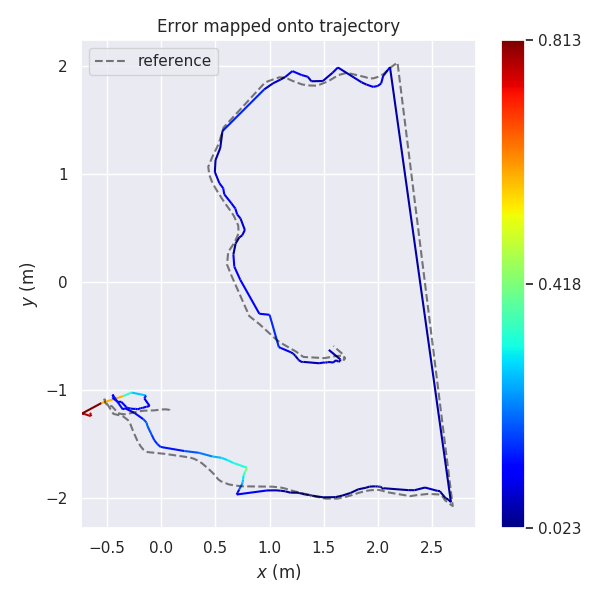
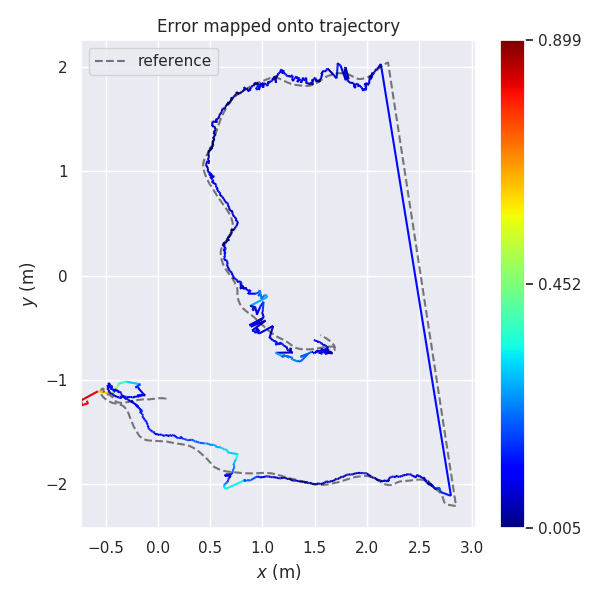
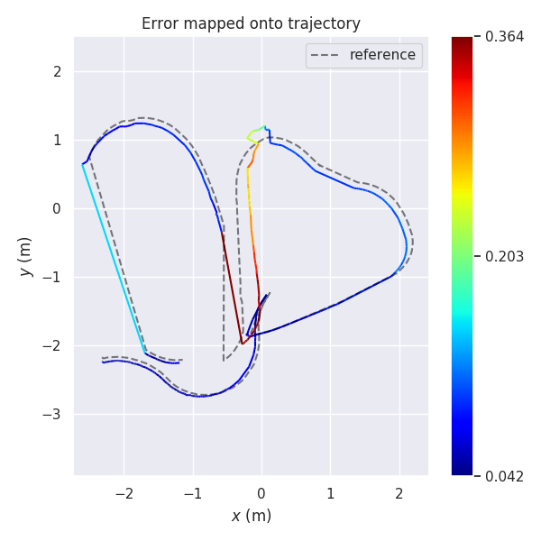
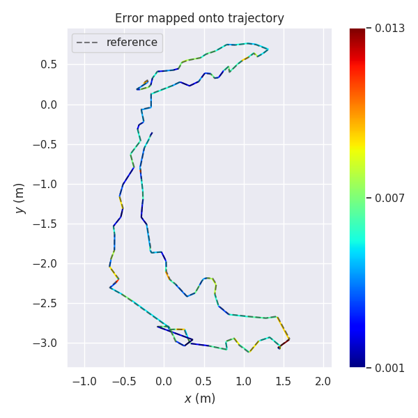
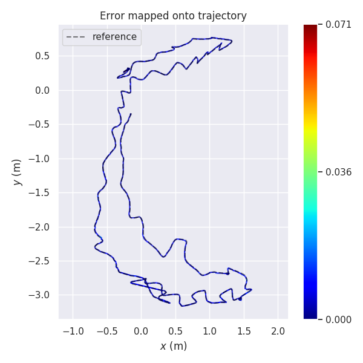
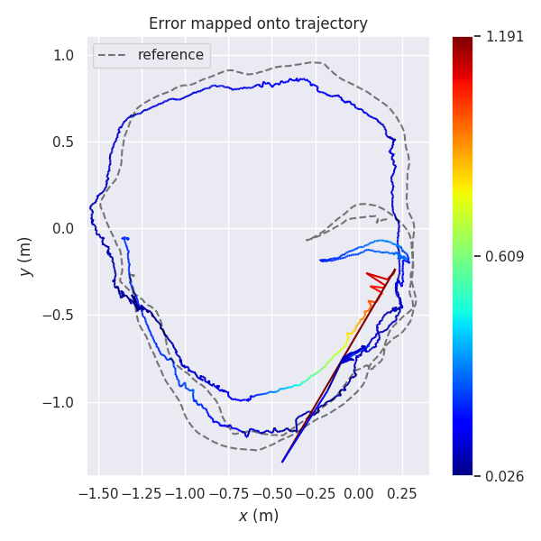

## TUM rgbd_dataset_freiburg2_large_with_loop

#### KeyFrame 

- std 0.1550
- sse 6.3089

#### Camera

- std 0.0981
- sse 25.2193

## TUM rgbd_dataset_freiburg2_pioneer_slam

#### KeyFrame 

- std 0.0928
- sse 8.9954

#### Camera

- std 0.1104
- sse 39.2383

## TUM rgbd_dataset_freiburg2_desk_with_person

#### KeyFrame 

- std 0.0022
- sse 0.0040

#### Camera

- std 0.0026
- sse 0.1280

## TUM rgbd_dataset_freiburg2_metallic_sphere

#### KeyFrame 

- std 0.1763
- sse 52.5717

#### Camera

- std 0.1434
- sse 101.0031

## <a href="/ORB2/Packages/evo-master.zip">evo evaluation tool</a>

https://github.com/MichaelGrupp/evo

