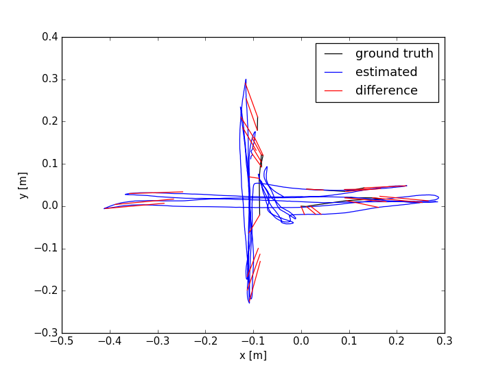
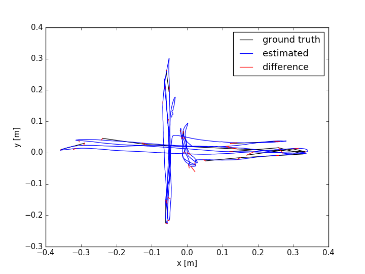
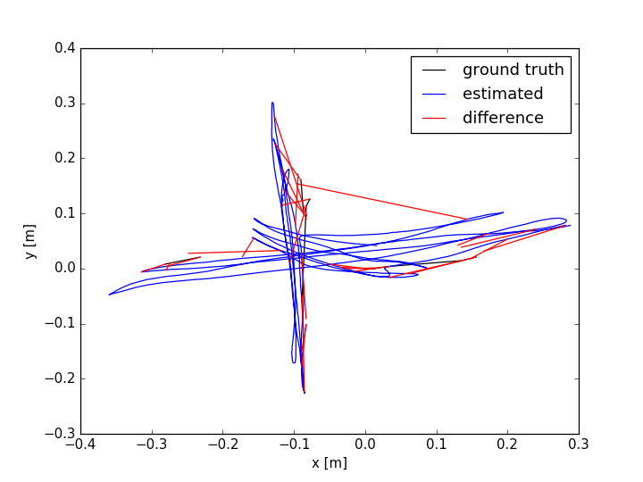
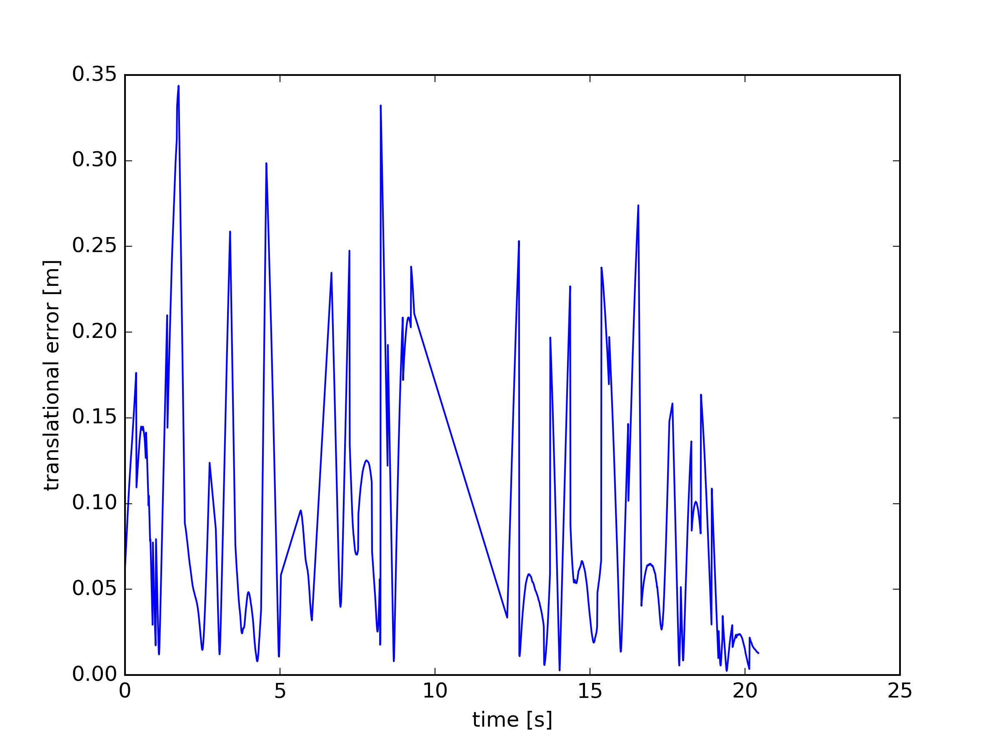
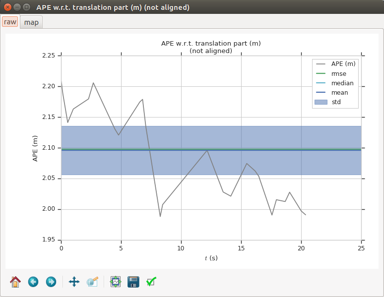
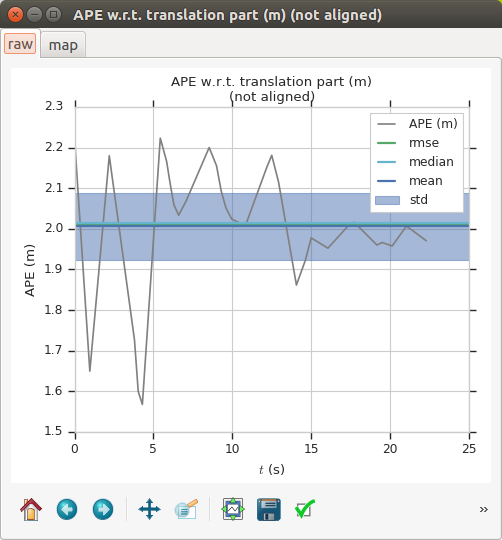

#### 使用TUM数据集中的rgbd_dataset_freiburg1_xyz验证Mono&&RGB-D效果

##### 说明

[TUM Dataset](https://vision.in.tum.de/data/datasets/rgbd-dataset/download)提供了估计轨迹的工具

- associate.py *将rgb和depth的时间戳融合生成视频序列*
- evaluate_ate.py *估计生成轨迹轨迹和ground_truth.txt轨迹的误差*
- evaluate_rpe.py *估计相邻时间戳估计间的平移和旋转误差`这个不是很确定`*
- ...

根据同一个数据集，使用Mono和RGB-D生成的轨迹，进行ate和rpe估计，将结果做一个比较发现，rgb-d的效果更好

运行结果分析见~/doc/tum-sensors





其中的groundtruth代表数据集提供的参考真实路线，也就是黑色线，这里不明显，蓝色线是ORB2估计的轨迹，红色线是两者间的绝对位置误差，通过每个位姿做差的模得到。这里因为单目存在一个初始化的过程，所以调整初始时间戳，再对比结果，已避免因时间戳导致的误差平均值增大。



从图中感觉到误差增大了，修改时间戳偏移值为3,5后，误差增大更多，数值误差为

| Mono     | RGB-D    |
| -------- | -------- |
| 0.076771 | 0.011636 |





以上两幅图是相对误差的输出，可以看出rgbd下时间轴更长，而在前3秒内有一个峰值。

##### EVO估计两种传感器得到的轨迹

| | Mono | RGB-D |
| --- |---------------------------------------------- | ----- |
| max |	2.211505 | 2.223129 |
|mean |	2.095994 | 2.005712|
|median |	2.095863 | 2.014141|
|min|1.987944 | 1.567782|
|rmse|	2.097485 | 2.012319|
|sse	|118.784952| 137.680588|
|std	|0.079065 |      0.162943 |





[TODO]使用同样的路径分析mono & rgb-d间的区别


##### 备注

EVO使用方法

- Install

```shell
#先使用官网提供的方法，可行忽略第二行
pip install evo --upgrade --no-binary evo
#如果出现pip 或者 numpy版本升级问题，尝试第二行命令
sudo python -m pip install evo --upgrade --no-binary evo  # or python2, python3...
```

- 计算ate rpe

```shell
evo_ate tum your_file1 your_file2 -p
evo_rpe tum your_file1 your_file2 your_file3... -p
```

