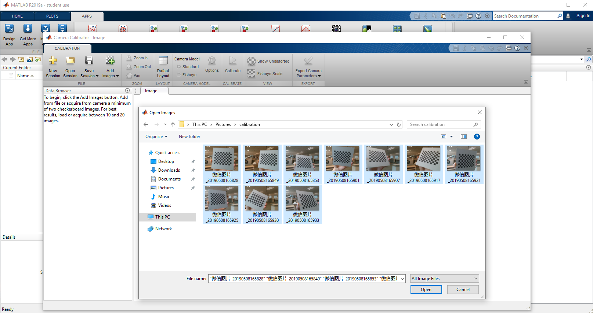
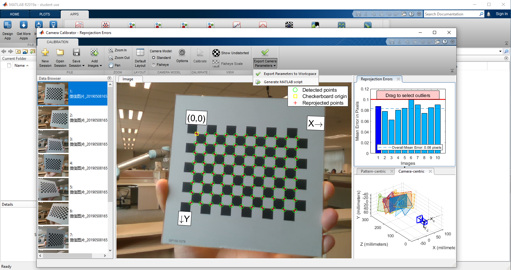
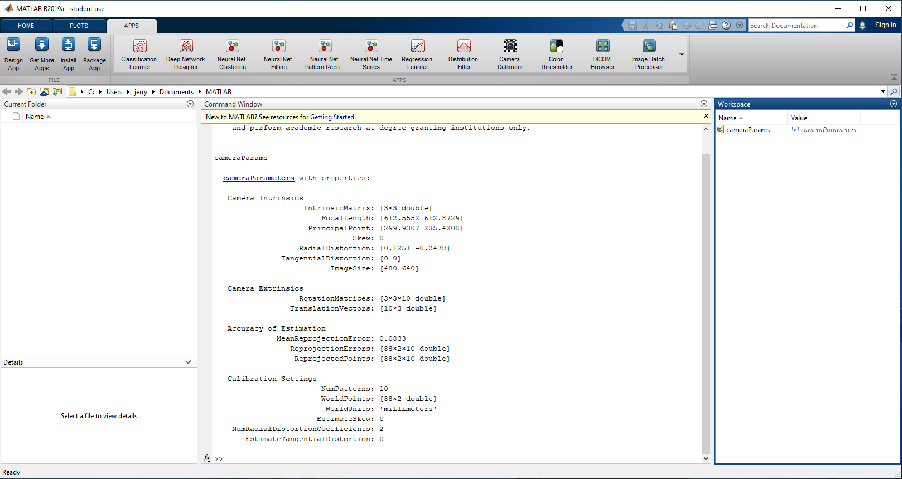
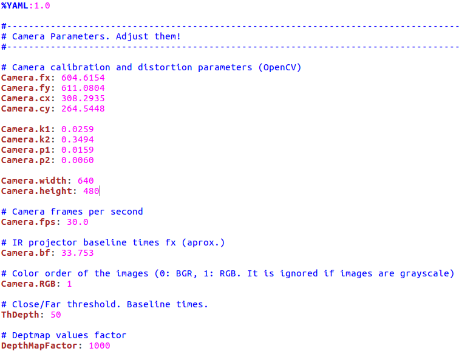
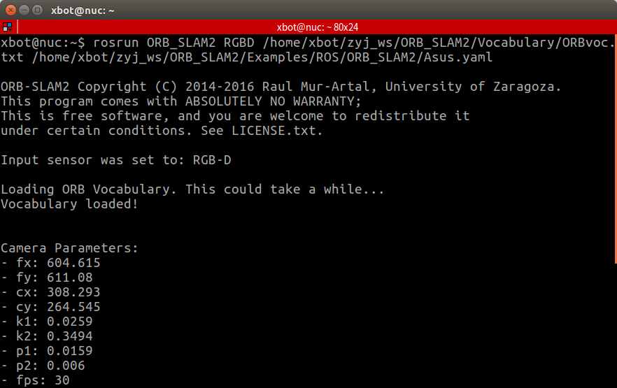
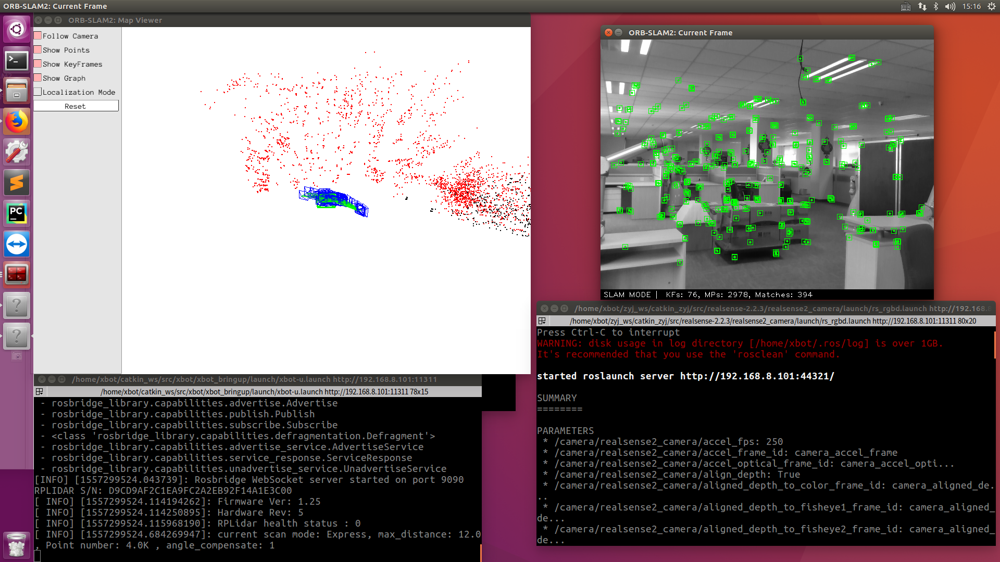

## ORB_SLAM2_xbot跑通与报错

### 摄像机标定

- 摄像机标定文件模板为 ORB_SLAM2/Examples/ROS/ORB_SLAM2/Asus.yaml
- 使用 opencv 或 ROS 或 matlab（推荐） 的标定软件对摄像机进行标定

### Matlab 标定工具

- 制作标定板
- 用摄像头从不同角度拍摄标定板
- 导入图片，使用 Matlab 标定工具进行标定 

  

- D415标定结果参考 

## 运行 ROS 的摄像头节点
- roslaunch realsense2_camera rs_camera.launch 或 roslaunch realsense2_camera rs_rgbd.launch

- rosrun ORB_SLAM2 RGBD PATH_TO_VOCABULARY PATH_TO_SETTINGS_FILE  ,  PATH_TO_VOCABULARY 通常为 ORB_SLAM2/Vocabulary/ORBvoc.txt  ,  PATH_TO_SETTINGS_FILE 为对应摄像头模式的标定文件

 

- 运行成功

## 常见报错

### 运行 rs_camera 节点时出现各种错误

- 安装 <a href="/ORB2/Packages/realsense-2.2.3.zip">realsense2.2.3</a> 最新驱动
- 安装 librealsense2 运行库 sudo apt-get install librealsense2
- 注意已经在运行的节点不能重复启动，xbot自动启动所有节点，测试时可关闭摄像机节点，在需要的时候再重新启动

### rosrun ORB_SLAM2 RGBD 运行时出现 'Error while trying to load shared file: xxx.so.xxx. No such file or directory' 等错误

- 安装 librscalibrationapi sudo apt-get install librscalibrationapi

### rosrun ORB_SLAM2 RGBD 节点运行成功，但是视框中没有图片输入

- 找到 realsense 驱动文件下 src 目录中的 rs_rgbd.launch 文件， 加入 \<remap from="/camera/aligned_depth_to_color/image_raw" to="camera/depth_registered/image_raw"/\> 和 \<remap from="/camera/color/image_raw" to="camera/rgb/image_raw"/\> 两行来选择正确的摄像机输入
  

