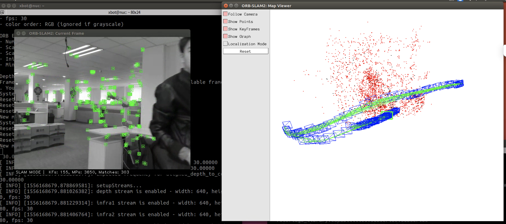
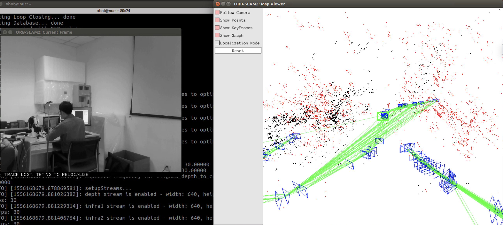
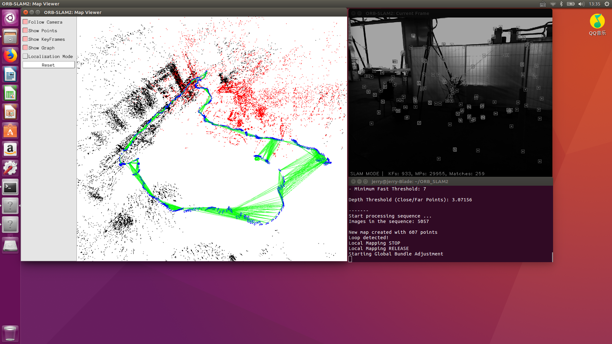
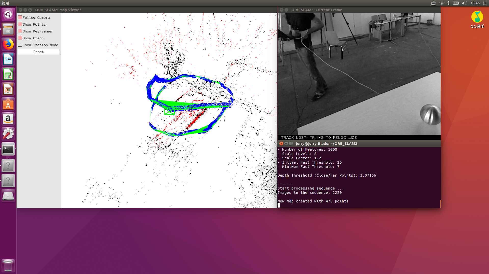
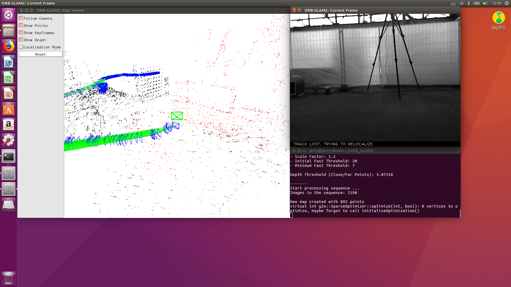

## 近距离的动态场景导致摄像机位姿漂移

## 在角速度超过0.8rad/s，线速度超过0.3m/s时，快速的转弯会导致跟踪丢失

## 当闭环很大的时候，全局集束调整的速度太慢，TUM rgbd_dataset_freiburg2_large_with_loop 数据集在测试中全局集束调整使用大概 57 秒

## 围绕某目标点旋转时，遇见陌生场景时丢失追踪

## 某些场景由于角点过少或角点计算太慢，掉帧等问题，导致关键帧的生成过慢，丢失追踪

