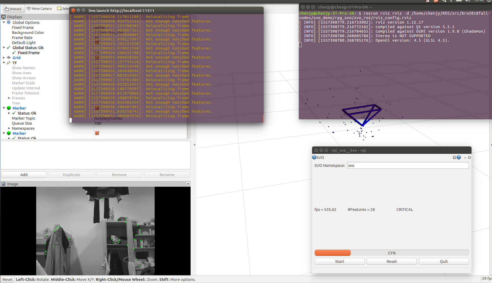
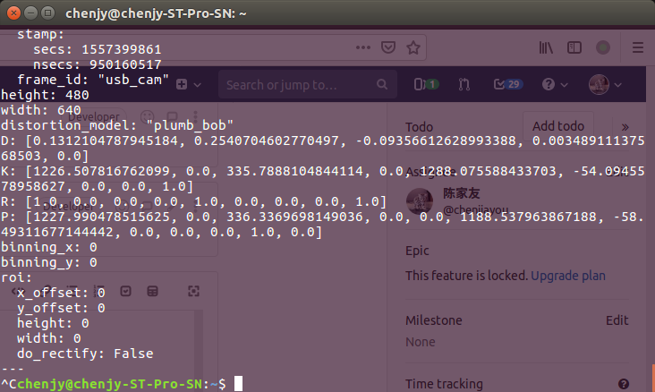

### 用自己的摄像头跑SVO
- Step1：编译usb_cam
~~~
cd catkin_ws/src
git clone https://github.com/ros-drivers/usb_cam.git
cd usb_cam
mkdir build
cd build
cmake ..
make
~~~
- 相机标定
参考：https://blog.csdn.net/qq_30460905/article/details/80390576
得到相机相关参数
~~~
image_width: 640
image_height: 480
camera_name: head_camera
camera_matrix:
  rows: 3
  cols: 3
  data: [1226.507816762099, 0, 335.7888104844114, 0, 1288.075588433703, -54.0945578958627, 0, 0, 1]
distortion_model: plumb_bob
distortion_coefficients:
  rows: 1
  cols: 5
  data: [0.1312104787945184, 0.2540704602770497, -0.09356612628993388, 0.00348911137568503, 0]
rectification_matrix:
  rows: 3
  cols: 3
  data: [1, 0, 0, 0, 1, 0, 0, 0, 1]
projection_matrix:
  rows: 3
  cols: 4
  data: [1227.990478515625, 0, 336.3369698149036, 0, 0, 1188.537963867188, -58.49311677144442, 0, 0, 0, 1, 0]
~~~
- 修改rpg_svo/svo_ros//param/camera_atan.yaml文件问对应参数
~~~
cam_model: Pinhole
cam_width: 640
cam_height: 480
cam_fx: 1226.507816762099
cam_fy: 1288.075588433703
cam_cx: 335.7888104844114
cam_cy: -54.0945578958627
cam_d0: 0.1312104787945184
cam_d1:  0.2540704602770497
cam_d2: -0.09356612628993388
cam_d3: 0.00348911137568503
~~~
- 改写SVO启动文件
修改rpg_svo/svo_ros/launch/live.launch文件参数（将订阅的topic改为USB_camer发布的topic)
将第六行改为`<param name="cam_topic" value="/usb_cam/image_raw" type="str" />`
- 用自己的摄像实时跑 
~~~
cd /catkin_ws
catkin_make
cd /catkin_ws/src/usb_cam/launch
roslaunch usb_cam-test.launch
roslaunch svo_ros live.launch
`rosrun rviz rviz -d <PATH TO rpg_svo>/svo_ros/rviz_config.rviz #改成相应自己的路径`
`rosrun rqt_svo rqt_svo`
~~~
### 操作截图

### 问题记录
- 相机参数问题
相机标定的过程挺麻烦，好像可以通过直接打印topic信息得到。
 运行相机后，通过以下命令得到相机参数
~~~
rostopic echo /usb_cam/camera_info
~~~
得到的参数矩阵和标定得到结果一致。

