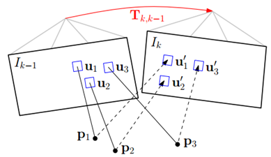
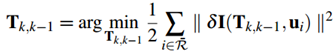
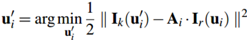
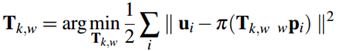
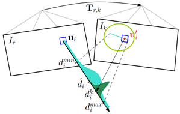
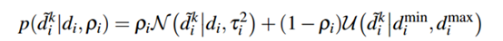
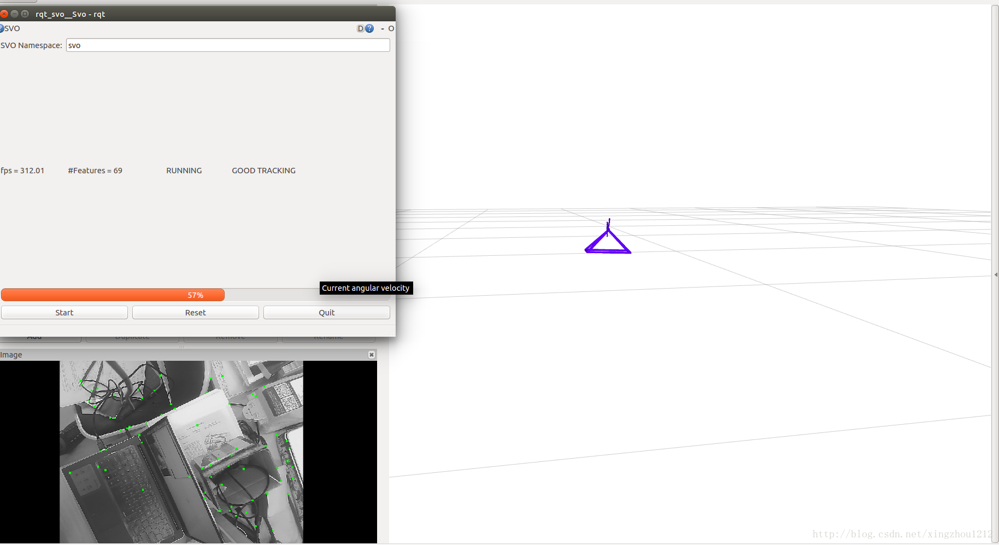
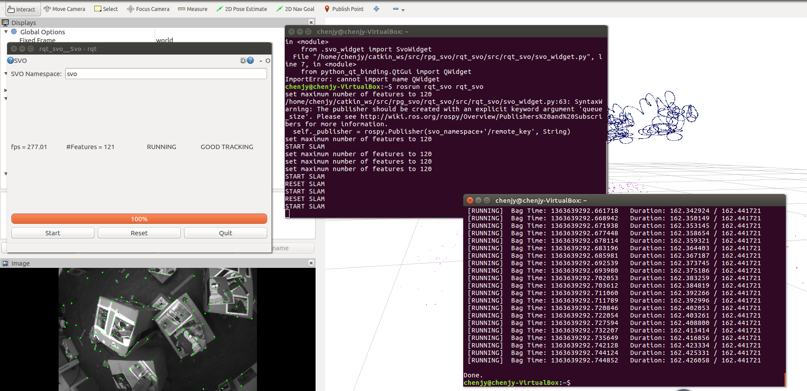
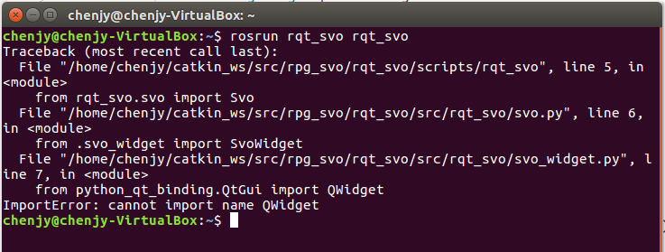

# SVO算法理论分析

### SVO算法理论分析记录:

- 算法介绍
 SVO（Semi-Direct Monocular Visual Odometry）半直接法视觉里程计，所谓半直接是指通过对图像中的特征点图像块进行直接匹配来获取相机位姿，而不像直接匹配法那样对整个图像使用直接匹配。 虽然semi-direct方法使用了特征，但它的思路主要还是通过direct method来获取位姿，这和feature-method不一样。同时，semi-direct方法和direct method不同的是它利用特征块的配准来对direct method估计的位姿进行优化。 通俗点说，就是结合了特征点法和直接法的视觉里程计。
- SVO干了什么事?
 SVO主要干了两件事，
 <1>跟踪
 <2>深度滤波
 深度滤波是我们常说的建图（Mapping）部分。
- 跟踪
 跟踪部分干的事情是：初始化位姿，估计和优化位姿(分别对应于帧间VO和局部地图优化)。
 1.初始化位姿：
 初始化思想：
 第一帧上提取的特征点，作为关键帧，后来的帧不断用KLT与第一帧匹配，
 直到匹配到的特征点平均视差比较大，就认为初始化成功，计算对应特征点的深度，
 与此对应的帧作为第二帧。之后进入估计和优化位姿。
 2.估计和优化位姿
 首先，通过和上一帧进行对齐，求取初始位姿；
 然后，建立局部地图，通过优化局部地图和当前帧的投影灰度块误差，来优化当前位姿；
 最后，判断此帧是否是关键帧，如果为关键帧就提取新的特征点。
 经过以上四个步骤，完成一帧的处理。
- 深度滤波
 深度滤波部分主要任务是完成估计特征点的深度信息。
 深度滤波和跟踪部分相互依赖，因为深度滤波是以相机位姿已知为前提进行的，而跟踪部分又依靠深度滤波的结果（较准确的三维点），完成位姿的估计。单目的slam在启动时的初始化提供粗糙的帧间位姿，以便于深度滤波和跟踪部分的迭代。当深度可以用后（称之为收敛），把它放入地图里，用于跟踪。

### 位姿估计
- 1.对稀疏的特征块使用direct method 配准，获取相机位姿；
 即sparse model-based image alignment
 使用直接法最小化图像块重投影残差来获取位姿。如图所示：其中红色的Tk,k−1为位姿，即要优化的变量。

 直接法具体过程如下：
    step1. 准备工作。假设相邻帧之间的位姿Tk,k−1已知，一般初始化为上一相邻时刻的位姿或者假设为单位矩阵。通过之前多帧之间的特征检测以及深度估计，假设我们已经知道第k-1帧中特征点位置以及它们的深度。
    step2. 重投影。知道Ik−1中的某个特征在图像平面的位置(u,v)，以及它的深度d，能够将该特征投影到三维空间pk−1，该三维空间的坐标系是定义在Ik−1摄像机坐标系的。所以，我们要将它投影到当前帧Ik中，需要位姿转换Tk−1，得到该点在当前帧坐标系中的三维坐标pk。最后通过摄像机内参数，投影到Ik的图像平面(u′,v′)，完成重投影。
    step3. 迭代优化更新位姿 。按理来说对于空间中同一个点，被极短时间内的相邻两帧拍到，它的亮度值应该没啥变化。但由于位姿是假设的一个值，所以重投影的点不准确，导致投影前后的亮度值是不相等的。不断优化位姿使得这个残差最小，就能得到优化后的位姿Tk,k−1。
   将上述过程公式化如下：通过不断优化位姿Tk,k−1最小化残差损失函数。 

 其中：

 公式中`第一步为根据图像位置和深度逆投影到三维空间`，`第二步将三维坐标点旋转平移到当前帧坐标系下`，`第三步再将三维坐标点投影回当前帧图像坐标`。
 我们已经能够估计位姿了，但是这个位姿肯定不是完美的。导致重投影预测的特征点在Ik中的位置并不和真正的吻合，也就是还会有残差的存在。如下图所示：

 图中灰色的特征块为真实位置，蓝色特征块为预测位置。
- 2.通过获取的位姿预测参考帧中的特征块在当前帧中的位置，由于深度估计的不准导致获取的位姿也存在偏差，从而使得预测的特征块位置不准。由于预测的特征块位置和真实位置很近，所以可以使用牛顿迭代法对这个特征块的预测位置进行优化。
 即Relaxation Through Feature Alignment
 通过`第一步的帧间匹配能够得到当前帧相机的位姿`，但是这种frame to frame估计位姿的方式不可避免的会带来累计误差从而导致漂移。所以，应该通过已经建立好的地图模型，来进一步约束当前帧的位姿。
 地图模型通常来说保存的就是三维空间点，因为每一个Key frame`通过深度估计能够得到特征点的三维坐标`，这些三维坐标点通过特征点在Key Frame中进行保存。所以SVO地图上保存的是Key Frame 以及还未插入地图的KF中的已经收敛的3d点坐标（这些3d点坐标是在世界坐标系下的），也就是说`地图map不需要自己管理所有的3d点，它只需要管理KF就行了`。先看看选取KF的标准是啥？KF中保存了哪些东西？当新的帧new frame和相邻KF的平移量超过场景深度平均值的12%时，new frame就会被当做KF，它会被立即插入地图。同时，又在这个新的KF上检测新的特征点作为深度估计的seed，这些seed会不断融合新的new frame进行深度估计。但是，如果有些seed点3d点位姿通过深度估计已经收敛了，map就用一个point_candidates来保存这些尚未插入地图中的点。所以`map这个数据结构中保存了两样东西，以前的KF以及新的尚未插入地图的KF中已经收敛的3d点`。
 通过地图我们保存了很多三维空间点，很明显，每一个new frame都是可能看到地图中的某些点的。由于new frame的位姿通过上一步的直接法已经计算出来了，按理来说这些被看到的地图上的点可以被投影到这个new frame中，即图中的蓝色方框块。上图中分析了，所有位姿误差导致这个方框块在new frame中肯定不是真正的特征块所处的位置。所以需要Feature Alignment来找到地图中特征块在new frame中应该出现的位置，根据这个位置误差为进一步的优化做准备。基于光度不变性假设，特征块在以前参考帧中的亮度应该和new frame中的亮度差不多。所以可以重新构造一个残差，对特征预测位置进行优化：

 这里的`优化变量是像素位置`，过程就是光流法跟踪,光度误差的前一部分是当前图像中的亮度值，后一部分不是Ik−1而是Ir.即它是根据投影的3d点追溯到的这个3d点所在的key frame中的像素值，而不是相邻帧。
 `通过这一步我们能够得到优化后的特征点预测位置，它比之前通过相机位姿预测的位置更准，所以反过来，我们利用这个优化后的特征位置，能够进一步去优化相机位姿以及特征点的三维坐标。`
- 3.特征块的预测位置得到优化，说明之前使用直接法预测的有问题。利用这个优化后的特征块预测位置，再次使用直接法，对相机位姿(pose)以及特征点位置（structure）进行优化。所以`位姿估计的最后一步就是Pose and Structure Refinement`。
在一开始的直接法匹配中，我们是使用的光度误差，这里由于优化后的特征位置和之前预测的特征位置存在差异，这个能用来构造新的优化目标函数。

上式中`误差变成了像素重投影以后位置的差异（不是像素值的差异）`，`优化变量还是相机位姿`，雅克比矩阵大小为2×6(横纵坐标u，v分别对六个李代数变量求导)。这一步是就叫做motion-only Bundler Adjustment。同时根据根据这个误差定义，我们还能够`对获取的三维点的坐标(x,y,z)进行优化`，还是上面的误差像素位置误差形式，只不过`优化变量变成三维点的坐标`，这一步叫Structure -only Bundler Adjustment，优化过程中雅克比矩阵大小为2×3(横纵坐标u，v分别对点坐标(x,y,z)变量求导)。
### 深度估计
`最基本的深度估计就是三角化`，这是多视角几何的基础内容。通过两帧图像的匹配点就可以计算出这一点的深度值，如果有多幅图像，那就能计算出这一点的多个深度值。这就像对同一个状态变量我们进行了多次测量，因此，可以用贝叶斯估计来对多个测量值进行融合，使得估计的不确定性缩小。如下图所示：

 一开始深度估计的不确定性较大(浅绿色部分)，通过三角化得到一个深度估计值以后，能够极大的缩小这个不确定性(墨绿色部分)。 
 svo中的三角化计算深度的过程，`主要是极线搜索确定匹配点`。在参考帧Ir中，我们知道了一个特征的图像位置，假设它的深度值在[dmin,dmax]之间，那么根据这两个端点深度值，我们能够计算出他们在当前帧Ik中的位置，如上图中草绿色圆圈中的线段。确定了特征出现的极线段位置，就可以进行特征搜索匹配了。如果极线段很短，小于两个像素，那直接使用上面求位姿时提到的Feature Alignment光流法就可以比较准确地预测特征位置。如果极线段很长，那分两步走，第一步在极线段上间隔采样，对采样的多个特征块一一和参考帧中的特征块匹配，用Zero mean Sum of Squared Differences 方法对各采样特征块评分，那个得分最高，说明他和参考帧中的特征块最匹配。第二步就是在这个得分最高点附近使用Feature Alignment得到次像素精度的特征点位置。像素点位置确定了，就可以三角化计算深度了。
得到一个新的深度估计值以后，用贝叶斯概率模型对深度值更新。
SVO的作者假设深度估计值服从Vogiatzis的论文《Video-based, real-time multi-view stereo》提到的概率模型：

 这个概率模型是`一个高斯分布加上一个设定在最小深度dmin和最大深度dmax之间的均匀分布`。这个均匀分布的意义是`假设会有一定的概率出现错误的深度估计值`。
 在深度估计的过程中，除了计算深度值外，这个深度值的不确定性也是需要计算的，它在很多地方都会用到，如极线搜索中确定极线的起始位置和长度，如用贝叶斯概率更新深度的过程中用它来确定更新权重，如判断这个深度点是否收敛了，如果收敛就插入地图等等。

### 跑通[数据集](https://github.com/uzh-rpg/rpg_svo/wiki/Run-SVO-with-ROS)

跑通教程：TODO

以下是截
图

### 问题记录

启动SVO GUI界面失败

 解决办法：
 将/rpg_svo/rqt_svo/src/rqt_svo/svo_widget.py文件`from python_qt_binding.QtGui import QWidget`改为`from python_qt_binding.QtWidgets import QWidget`

