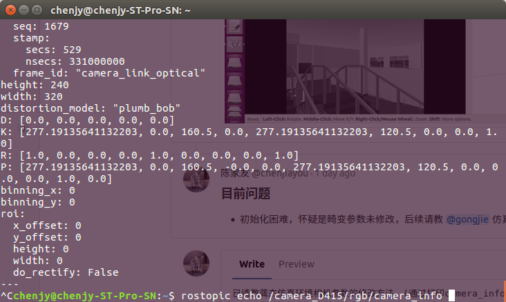
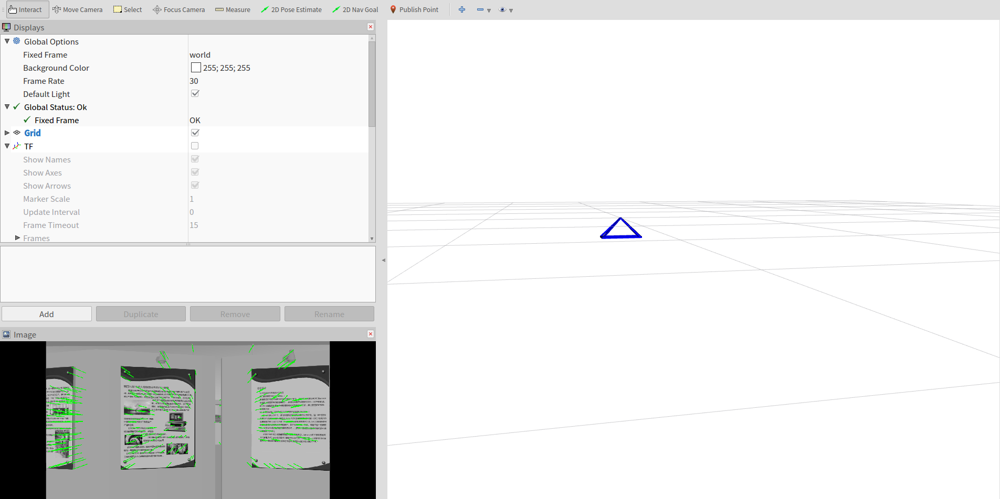
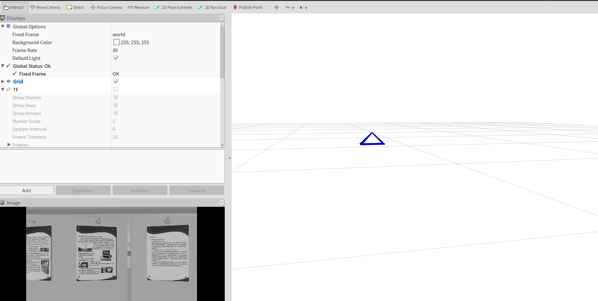

## SVO部署到Xbot
### 运行环境
* Ubuntu 16.04
* ROS-kinetic
* bro2018fall-codes代码
* 之前SVO部署的依赖库（参考[SVO安装与测试](https://yt.droid.ac.cn/beijing/nagato-yuki/issues/75)）
### 安装部署
- 下载SVO代码
~~~
在~/ROS/src/bro2018fall-codes/svo_demo文件夹下打开终端
$ git clone https://github.com/uzh-rpg/rpg_vikit.git
$ git clone https://github.com/uzh-rpg/rpg_svo.git
$ cd ~/ROS
$ catkin_make
~~~
- 修改相机参数
 1.启动博物馆场仿真场景后打印Xbot相机参数
~~~
$ roslaunch robot_sim_demo robot_spawn.launch
$ rostopic echo /camera/rgb/camera_info
~~~
截图如下：
 
 2.修改~/ROS/src/bro2018fall-codes/svo_demo/rpg_svo/svo_ros/param/camera_atan.yaml文件为：
~~~
cam_model: Pinhole
cam_width: 1280
cam_height: 720
cam_fx: 1108.7654256452881
cam_fy: 1108.7654256452881
cam_cx: 640.5
cam_cy: 360.5
cam_d0: 0
cam_d1: 0
cam_d2: 0
cam_d3: 0
~~~
- 修改SVO订阅的摄像头topic
 修改~/ROS/src/bro2018fall-codes/svo_demo/rpg_svo/svo_ros/launch/live.launch文件第6行为：
 `<param name="cam_topic" value="/camera/rgb/image_raw" type="str" />`
- 启动测试
~~~
$ cd ~/ROS
$ catkin_make 
$ roslaunch robot_sim_demo robot_spawn.launch
$ roslaunch svo_ros live.launch
$ rosrun rviz rviz -d /home/chenjy/ROS/src/bro2018fall-codes/svo_demo/rpg_svo/svo_ros/rviz_config.rviz
$ rosrun rqt_svo rqt_svo
在SVO Namespace 填入svo
~~~
启动后截图如下：

### 问题记录
- 初始化失败(图像无特征点)
 截图如下：
 
 之前仿真平台的Xbot摄像头分辨率太低，初始化困难，后经 @anchuanxu 修改代码,更改摄像头分辨率后初始化就很容易。
### SVO算法部署现状
SVO适用于摄像头垂直向下的情况，跑自己的摄像头及部署到仿真Xbot中的效果不是很理想。
