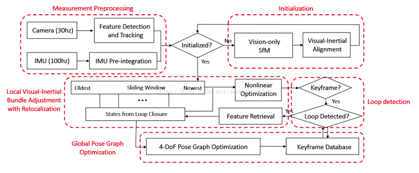

### 1 VINS-Mono背景简介

VINS-Mono是香港科技大学沈劭劼团队于2018年开源的单目视觉惯导SLAM方案。是视觉与IMU融合中的经典之作，其定位精度可以媲美OKVIS，而且具有比OKVIS更加完善和鲁棒的初始化以及闭环检测过程。

### 2 整体概述

VINS-Mono是基于优化和滑动窗口的VIO，使用IMU预积分构建紧耦合框架。并且具备自动初始化，在线外参标定，重定位，闭环检测，以及全局位姿图优化功能。由数据预处理、初始化、后端非线性优化、回环检测和全局位姿图优化五部分组成。

 (1)数据预处理

相机：特征提取和跟踪，包括提取图像Harris角点，利用光流法跟踪相邻帧，通过RANSAC去除异常点，最后将跟踪到的特征点push到图像队列中，并通知后端进行处理。

IMU：将IMU数据进行积分，得到当前时刻的位置、速度和旋转（PVQ），同时计算在后端优化中将用到的相邻帧的预积分增量，及预积分误差的Jacobian矩阵和协方差项。

(2)初始化

初始化是整个VIO系统中非常重要的一部分，VIO系统通过初始化得到IMU的一些包括漂移、重力加速度等在内的参数，同时也为视觉定位提供了尺度信息。

首先，利用SFM进行纯视觉估计滑窗内所有帧的位姿及特征点位置，最后与IMU预积分进行对齐求解初始化参数。

(3)后端非线性优化

后端优化部分, 也就是VIO部分, 是VINS算法的核心。它是VINS-Mono中除了初始化之外，创新性最高的一块，也是真真的 紧耦合部分，而初始化的过程事实上是一个松耦合。因为初始化过程中的状态量并没有放在最底层融合，而是各自做了位姿的计算，但是在后端优化的过程中，所有优化量都是在一起的。

它将视觉约束、IMU约束和闭环约束放在一个大的目标函数中进行非线性优化，求解滑窗内所有帧的PVQ和bias。

(4)闭环检测

利用DBoW做回环检测，当检测成功后进行重定位。算是比较常规的做法。

这里的回环检测，是每3个关键帧检测一帧，相当于是跳两帧。因为回环检测的速度总是慢于关键帧生成的速度，所以为了保持回环检测的关键帧不落后，只能跳帧检测。

(5)全局位姿图优化

之前做的非线性优化本质上只是在一个滑窗内求解出了相机的位姿，而且在回环检测部分，利用固定位姿的回环帧只是纠正了滑窗内的相机位姿，并没有修正其他位姿(或者说没有将回环发现的误差分配到整个相机的轨迹上)，缺少全局的一致性，所以要做一次全局的Pose Graph。

### 3 评估
VINS-Mono是目前开源SLAM里面效果非常不错的Visual和Inertial融合SLAM算法, 通过Sliding Windows优化进行视觉和IMU的紧耦合实现VIO, 此外还加了DBoW做Loop Closure, 算是一套完整的SLAM系统. 该算法的前端比较简单,就Harris角点加LK光流跟踪, Loop Closure也挺常规, 算法的厉害之处在于后端Visual Inertial融合优化部分, 也就是VIO部分, 这是VINS算法的核心。

但是，从实际运行效果来看：

（1）vins纯旋转会飘，所以初始化必须平移加旋转，并且是快速地移动，当然移动是包括平移和旋转的；

（2）初始化相对来讲有些麻烦，因为每次启动都要进行初始化；

（3）运行过程中，视觉跟踪失败即一小段没有特征点或者移动太快的时候IMU会飘的很离谱；

（4）尺度信息是依赖IMU的预积分值，而不是直接获取的，如此一来，就会产生误差，影响精度和鲁棒性；

