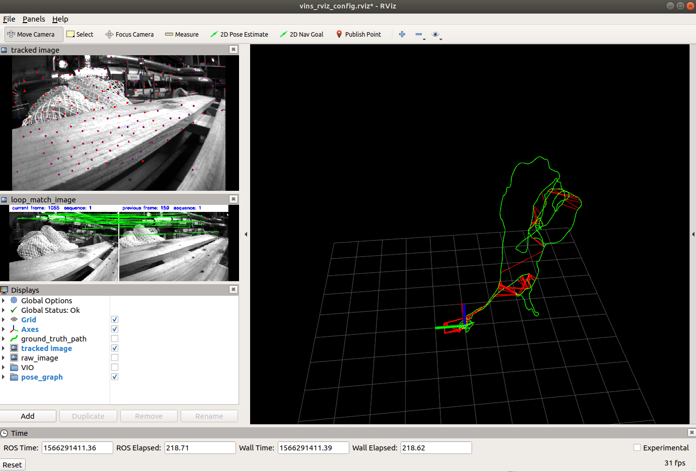

#### 环境

ubuntu16.04 ,ROS kinetic,opencv 3.4.5 ,Eigen3.3.4,ceres-solver

### 1 安装ROS依赖包

```
sudo apt-get install ros-melodic-cv-bridge ros-melodic-tf ros-melodic-message-filters ros-melodic-image-transport
```

### 2 在ROS下编译VINS-Mono

```
cd ~/vins_ws/src
git clone https://github.com/HKUST-Aerial-Robotics/VINS-Mono.git
cd ..
catkin_make
echo "source ~/vins_ws/devel/setup.bash" >> ~/.bashrc
```

### 3 在公开数据集上测试VINS-Mono

1. 下载公开数据集，下载地址为：https://projects.asl.ethz.ch/datasets/doku.php?id=kmavvisualinertialdatasets#downloads 

```
cd ~/vins_ws/src/VINS-Mono
mkdir Data
```

   将下载好的数据集放在`Data`文件夹中

2. 打开三个终端，分别启动`vins_estimator`,`rviz`和播放bag文件。以MH_01为例：

```
roslaunch vins_estimator euroc.launch 
roslaunch vins_estimator vins_rviz.launch
rosbag play ~/workspace/src/VINS-Mono/Data/MH_01_easy.bag
```




