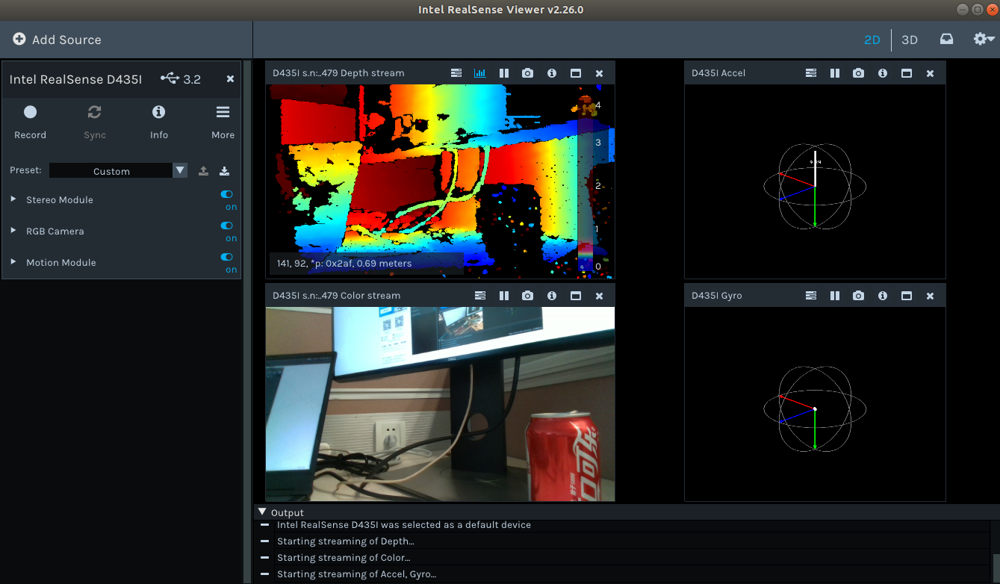
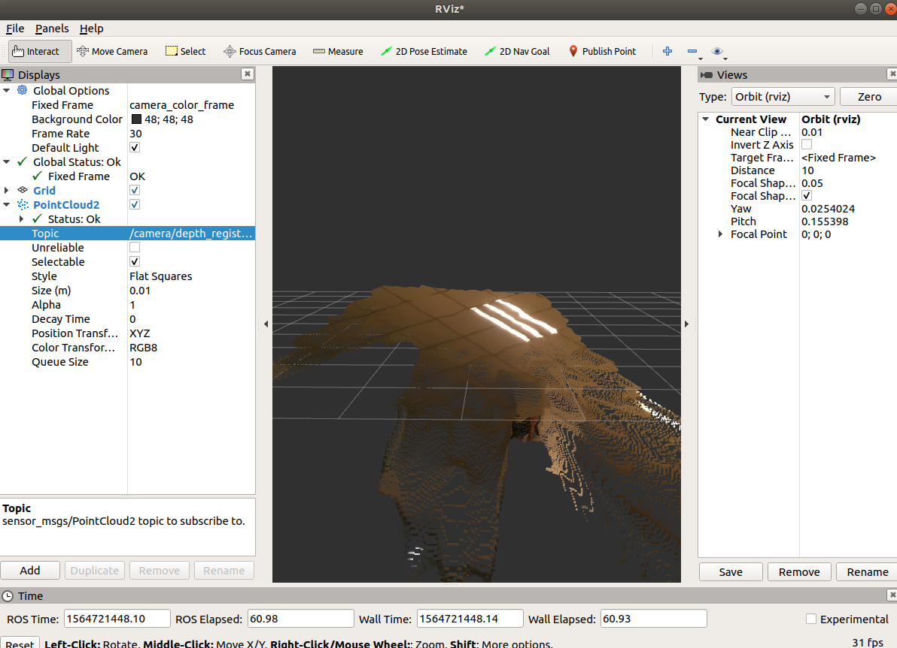
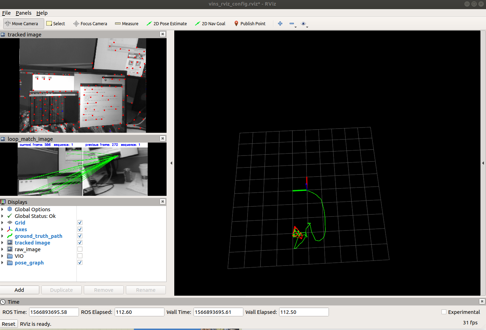

#### Realsense D435i运行VINS-Mono

#### 安装Realsense SDK2.0

librealsense SDK相当于相机的驱动,D435i是librealsense SDK 2.0,我们采用命令行安装的方式来进行安装，步骤如下：

1. 添加Intel 服务器到仓库列表

```
echo 'deb http://realsense-hw-public.s3.amazonaws.com/Debian/apt-repo xenial main' | sudo tee /etc/apt/sources.list.d/realsense-public.list
```

2. 注册公钥

```
sudo apt-key adv --keyserver keys.gnupg.net --recv-key 6F3EFCDE
```

3. 更新仓库

```
sudo apt-get update
```

4. 安装libraries

```
sudo apt-get install librealsense2-dkms
sudo apt-get install librealsense2-utils
```

5. 安装一些额外的package

```
sudo apt-get install librealsense2-dev
sudo apt-get install librealsense2-dbg
```

6. 连接相机，输入以下命令

```
realsense-viewer
```

出现以下画面：



出现以上画面则表面安装成功。

#### 安装ROS Wrapper

ROS Wrapper指相机对应的ROS版本的开发包，安装步骤如下：

1. 建立工作空间(已经执行过的不需要再执行此步骤)

```
mkdir -p ~/vins_ws/src
cd ~/workspace/src/
catkin_init_workspace 
cd ..
catkin_make
echo "source ~/vins_ws/devel/setup.bash" >> ~/.bashrc
source ~/.bashrc
```

2. 下载源码包

```
cd ~/vins_ws/src
git clone https://github.com/intel-ros/realsense.git
```

3. 在ROS下编译

```
cd ..
catkin_make
```

4. 启动相机节点

```
roslaunch realsense2_camera rs_rgbd.launch
```

5. 查看此时的topic,可以发现acc和gyr的信息是分别发布在两个topic上的。

```
rostopic list
```

6. 通过rviz查看图像

```
rosrun rviz rviz
```




执行上述命令之后，添加PointCloud2并订阅相关话题出现图像。

另外，若不对相机进行标定，可以先从Realsense ROS Wrapper发布的topic中获得相机的内参，执行一下命令查看相机参数

```
rostopic echo /camera/color/camera_info 
rostopic echo /camera/aligned_depth_to_color/camera_info
```

#### D435i上运行VINS-Mono

1. 修改realsense包里的rs_camera.launch文件

   1.1 打开rs_camera.launch文件

   ```
   cd ~/workspace/src/realsense/realsense2_camera/launch/
   gedit ./rs_camera.launch
   ```

   1.2  修改`unite_imu_method`如下，目的是为了让IMU的角速度和加速度合起来作为一个topic输出

   ```
    <arg name="unite_imu_method"      default="copy"/>
   ```

   1.3 修改`enable_sync`参数为true，目的的开启相机和IMU的同步

   ```
    <arg name="enable_sync"           default="true"/>
   ```

2. 修改VINS-Mono包里的realsense_color_config.yaml文件

   2.1  修改订阅的topic

   ```
   imu_topic: "/camera/imu"
   image_topic: "/camera/color/image_raw"
   ```

   2.2 获取相机内参，通过读取camera_info得到或者自己标定

   通过camera_info得到方式如下：

   打开一个终端

   ```
   roslaunch realsense2_camera rs_camera.launch
   ```

   再打开一个终端

   ```
   rostopic echo /camera/color/camera_info
   ```

   获取相机参数之后，修改`realsense_color_config.yaml`中的相应位置。

   2.3 IMU到相机的变化矩阵

   IMU和camera之间的外参矩阵建议使用Kalibr工具进行离线标定，（也可以将realsense_color_config.yaml中的estimate_extrinsic改成1或者2让估计器自己优化。）

   ```
   estimate_extrinsic: 2   # 0  Have an accurate extrinsic parameters. We will trust the following imu^R_cam, imu^T_cam, don't change it.
                           # 1  Have an initial guess about extrinsic parameters. We will optimize around your initial guess.
                           # 2  Don't know anything about extrinsic parameters. You don't need to give R,T. We will try to calibrate it. Do some rotation movement at beginning.                        
   #If you choose 0 or 1, you should write down the following matrix.
   ```

   2.4  IMU参数修改，这里使用了注释给定的参数

   ```
   #imu parameters       The more accurate parameters you provide, the better performance
   acc_n: 0.2          # accelerometer measurement noise standard deviation. #0.2
   gyr_n: 0.05         # gyroscope measurement noise standard deviation.     #0.05
   acc_w: 0.02         # accelerometer bias random work noise standard deviation.  #0.02
   gyr_w: 4.0e-5       # gyroscope bias random work noise standard deviation.     #4.0e-5
   g_norm: 9.80       # gravity magnitude
   ```

   2.5  D435i已经做好了硬件同步不需要在线估计同步时差

   ```
   #unsynchronization parameters
   estimate_td: 0                      # online estimate time offset between camera and imu
   td: 0.000                           # initial value of time offset. unit: s. readed image clock + td = real image clock (IMU clock)
   ```

   2.6 相机曝光方式改成全局曝光

   ```
   #rolling shutter parameters
   rolling_shutter: 0                     # 0: global shutter camera, 1: rolling shutter camera
   rolling_shutter_tr: 0                  # unit: s. rolling shutter read out time per frame (from data sheet).
   ```

3. 连接相机，运行VINS-Mono

```
roslaunch realsense2_camera rs_camera.launch 
roslaunch vins_estimator realsense_color.launch 
roslaunch vins_estimator vins_rviz.launch
```

运行画面如下：



从实际运行运行效果来看，初始化需要一定时间，运行过程中，视觉跟踪失败即一小段没有特征点或者移动太快的时候IMU会飘的很离谱。

